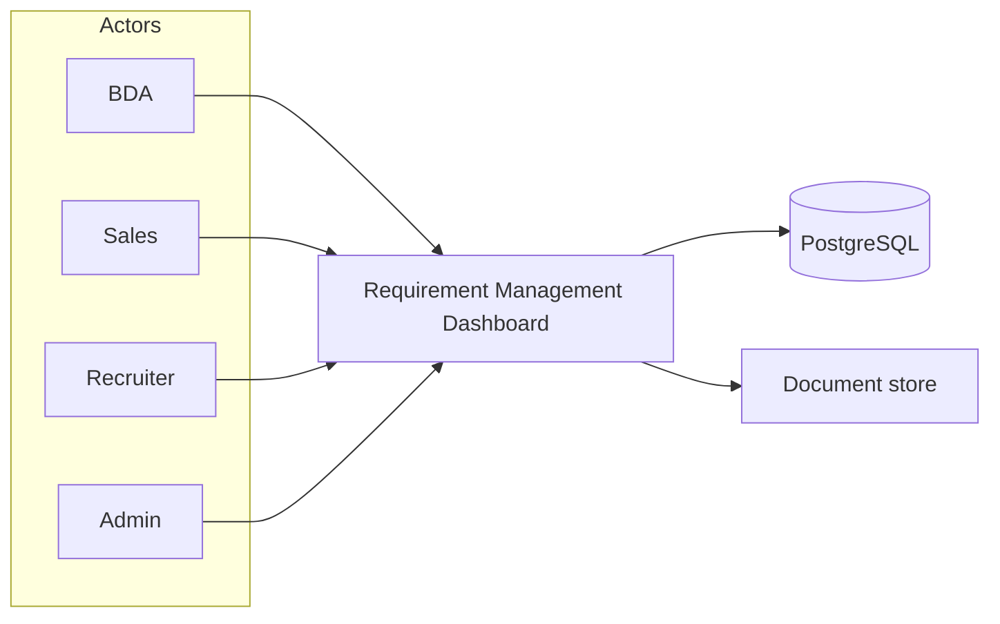
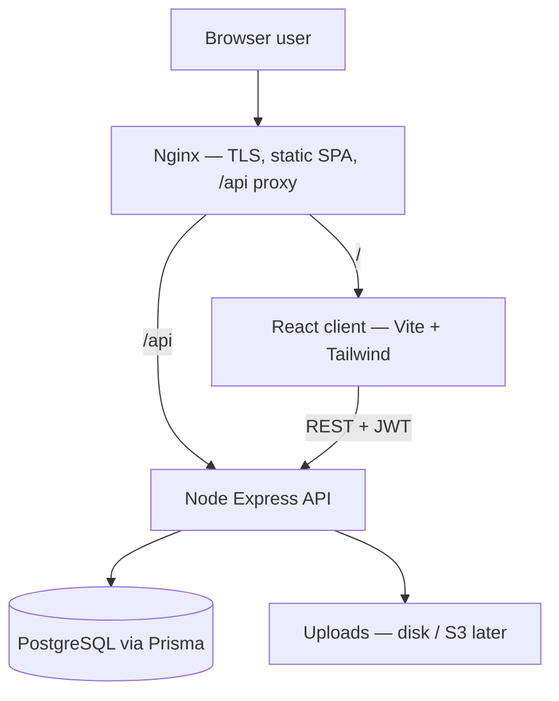
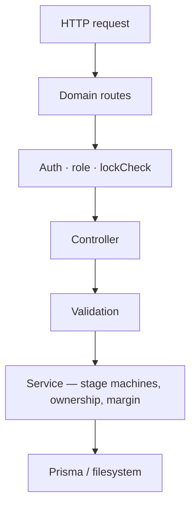
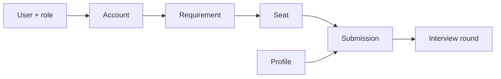
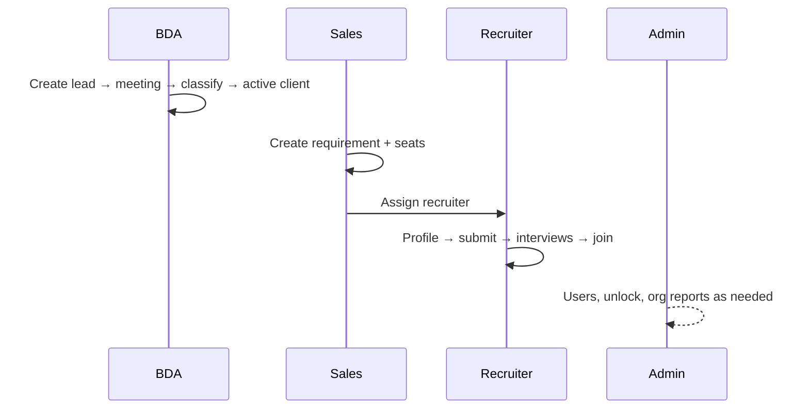
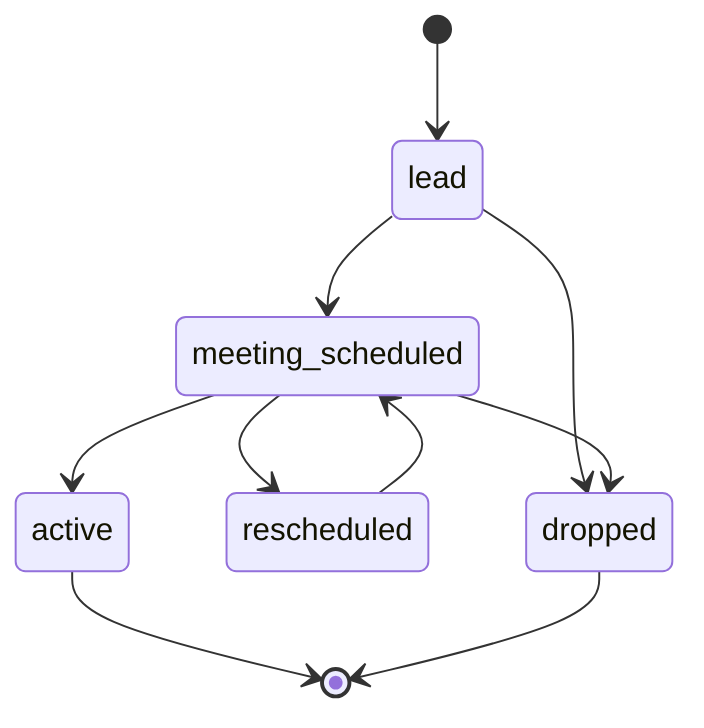
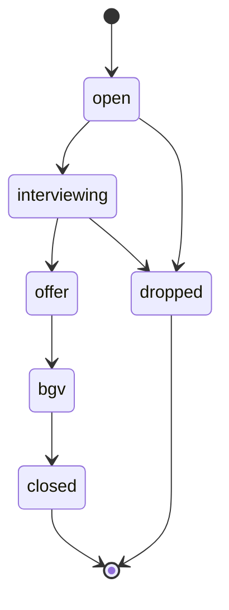
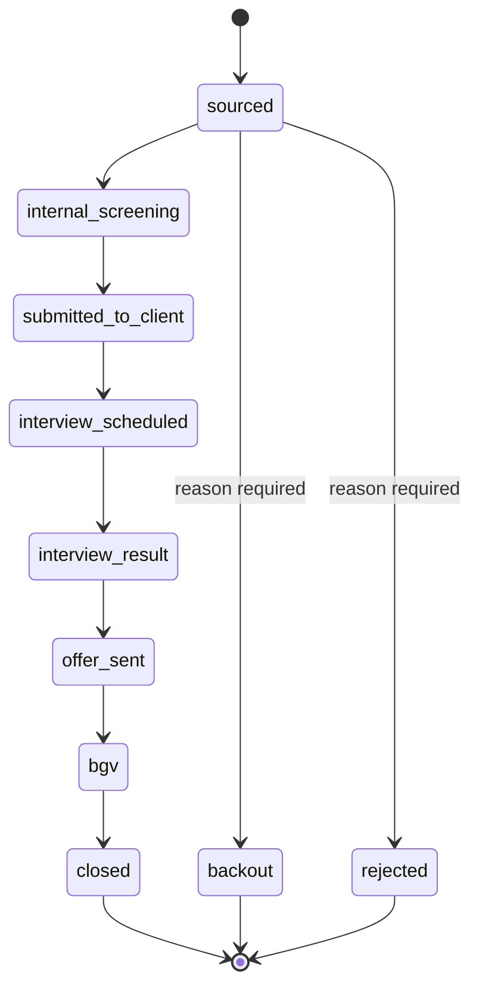

# Requirement Management Dashboard

Internal recruitment pipeline for Delphic. Tracks **client / vendor accounts → requirements → seats → candidate profiles → submissions → interview rounds**, with role-based dashboards, margin tracking, locking, and reporting.

| | |
|---|---|
| **Tenancy** | Single tenant |
| **UI rule** | Jira-like dense lists and filters — [docs/ui/UI-UX-JIRA.md](docs/ui/UI-UX-JIRA.md) |
| **Detailed HLD** | [docs/architecture/HLD.md](docs/architecture/HLD.md) |
| **Field model** | [docs/architecture/Requirement-Dashboard-System-Design-v2.md](docs/architecture/Requirement-Dashboard-System-Design-v2.md) |
| **API contract** | [docs/architecture/API-Spec-and-Build-Plan.md](docs/architecture/API-Spec-and-Build-Plan.md) |
| **Diagrams & journeys** | [docs/architecture/ARCHITECTURE-OVERVIEW.md](docs/architecture/ARCHITECTURE-OVERVIEW.md) |

## Table of contents

1. [What it does](#what-it-does)
2. [Design principles](#design-principles)
3. [Architecture](#architecture)
4. [Feature map](#feature-map)
5. [Domain model](#domain-model)
6. [User journeys](#user-journeys)
7. [Stage pipelines](#stage-pipelines)
8. [Roles and permissions](#roles-and-permissions)
9. [Security](#security)
10. [Reporting](#reporting)
11. [API surface](#api-surface)
12. [Codebase structure](#codebase-structure)
13. [Stack](#stack)
14. [Branching](#branching)
15. [Local setup](#local-setup)
16. [Deployment](#deployment)
17. [Further reading](#further-reading)

---

## What it does

| Role | Goal |
|---|---|
| **BDA** | Capture and convert client / vendor leads |
| **Sales** | Open job requirements and seats; assign recruiters |
| **Recruiter** | Source candidates, submit to seats, run interviews through join, track margin |
| **Admin** | Manage users, unlock locked records, read org-wide reports |

### In scope

- Full core pipeline with stage machines and append-only stage history
- Lead capture before client/vendor is known, with a one-way classify step
- Candidate on-bench flag and filter
- Role-based access and ownership scoping
- Record locking on terminal states, with admin unlock + reason
- Margin / commercials on submissions
- Role-scoped dashboard (including stuck lists)
- Reports with date range and Excel / PDF export
- Comments and documents on core entities
- Jira-like dense list / filter UX

### Deferred

- Notifications
- Vendor / client external portals
- JIRA / Sheets migration tooling
- Multi-tenant SaaS isolation
- Real-time collaboration (WebSockets)
- SSO

---

## Design principles

1. **Pipeline as state machines** — Account, seat, and submission progress only through documented transitions; every move is audited in `stage_history`.
2. **Auth and authorization at the edge** — JWT and role checks live in transport middleware; services receive a narrowed identity (user id, role).
3. **Thin transport, fat domain** — Route handlers parse HTTP and call services; stage advance, margin, ownership, and lock rules live in services.
4. **Ownership scopes visibility and mutation** — BDA owns accounts; Sales owns requirements; Recruiter works assigned requirements; Admin sees everything.
5. **Lock is editability, not visibility** — Terminal records stay in lists and reports; mutations are blocked until Admin unlocks with a reason.
6. **Single source of schema truth** — Prisma models and migrations define persistence; API validation mirrors enums and required fields.
7. **Readable modules** — Domain folders follow `routes → controller → service → validation`.

---

## Architecture

### System context



### Containers and request path



| Container | Responsibility |
|---|---|
| **Web client** | Screens, forms, JWT session, role-gated navigation |
| **API server** | Auth, validation, stage machines, ownership, reports, uploads |
| **PostgreSQL** | Durable entities, history, assignments |
| **Nginx** | TLS, static assets, API reverse proxy |
| **Document store** | Binary uploads (API gates access) |

### Server call graph



Services do not import Express request types. Controllers stay thin.

---

## Feature map

| Domain | Covers |
|---|---|
| **Auth & users** | Login, refresh, change password, admin user provisioning |
| **Accounts** | Client / vendor leads (type unset until BDA classifies), stage machine, one-way classify, meeting mode / location / attendees, BDA ownership, lock on drop |
| **Requirements & seats** | Jobs (managed services / recruitment / project), seats, assign / unassign history, seat stages |
| **Profiles** | Candidates, skills, CTC, availability, on-bench flag, resume upload |
| **Submissions** | Put candidate forward, pipeline stages, margin, kanban by stage |
| **Interviews** | Six named rounds (`internal_r1/r2`, `client_r1/r2/r3`, `hr_cto_ceo`), schedule, feedback, rating, result; soft warning on missing mandatory rounds |
| **Collaboration** | Comments, documents, stage history audit |
| **Ops & insights** | Role-scoped dashboard with click-through KPI cards, stuck lists, reports (incl. client / vendor performance), Excel / PDF export |

---

## Domain model

### Entity chain



Supporting entities: **RequirementAssignment**, **Comment**, **Document**, **StageHistory**.

### Entity catalogue

| Entity | Purpose | Lock trigger |
|---|---|---|
| **User** | Identity + role (`bda` \| `sales` \| `recruiter` \| `admin`) | Soft-deactivate via `active` |
| **Account** | Unified lead; `type` (`client` \| `vendor`) is null until a one-way classify | `dropped` |
| **Requirement** | Job / project on an **active client** | `closed` / `dropped` |
| **RequirementSeat** | One headcount slot | `closed` / `dropped`; `joined_at` counts as closure |
| **RequirementAssignment** | Recruiter / sales assignment history (never deleted) | Soft end via `unassigned_at` |
| **Profile** | Candidate | — |
| **Submission** | Candidate × seat + commercials | Terminal pipeline stages |
| **InterviewRound** | One of six named rounds (`internal_r1/r2`, `client_r1/r2/r3`, `hr_cto_ceo`) + feedback / rating | Completing result sets `completed_at` |
| **StageHistory** | Append-only audit of stage moves / unlock | Immutable |
| **Document** / **Comment** | Files and notes linked by entity type + id | — |

### Key invariants

1. An account's **`type`** is set once, one-way, via `POST /accounts/:id/classify` (logged to `stage_history`); a lead can sit unclassified.
2. A **requirement** may only attach to an account with `type = client` and `stage = active`.
3. **Submissions** target a seat (headcount), not only a requirement.
4. **Assignments** are historical rows; unassign sets `unassigned_at` instead of deleting.
5. **Interview rounds** use six named types; `offer_sent` is hard-gated on unresolved rounds and `closed` on uncleared BGV, plus a soft warning when mandatory rounds (`internal_r1`, `hr_cto_ceo`) are missing.
6. **Margin** is computed on the server from commercial fields.
7. **Unlock** requires Admin + mandatory reason; audited; next terminal transition re-locks.

---

## User journeys

### End-to-end handoff



| # | Who | Handoff |
|---|---|---|
| 1 | BDA | Creates lead → converts client to **active** |
| 2 | Sales | Opens requirement + seats; **assigns** recruiter |
| 3 | Recruiter | Adds profile, submits to seat, runs interviews to **join** |
| 4 | Admin | Unlocks records, manages users, reads **org** reports |

### BDA — lead to active account

| Step | Action | Outcome |
|---|---|---|
| 1. Capture lead | Create account with company + POC; `type` may be left unset | Stage = `lead`; BDA is owner |
| 2. Schedule meeting | Move → `meeting_scheduled`; set mode, date, notes, `meeting_location` (required when offline), Sales attendees | Tracked; can appear on stuck list if idle |
| 3. Classify | `POST /accounts/:id/classify` → `client` or `vendor` (one-way, audited) | Commercial fields for that type become relevant |
| 4. Convert or loop | → `active`, or `rescheduled` → meeting again | Active client unlocks Sales requirements |
| 5. Exit | Drop with reason → record locks | Visible in reports; Admin can unlock |

### Sales — open job and assign

| Step | Action | Outcome |
|---|---|---|
| 1. Pick active client | Open an active client account | Requirements only on active clients |
| 2. Create requirement | JD, tech stack, budget, seats, SLA | Status = `open`; Sales is owner |
| 3. Add seats | One seat per headcount | Seat status = `open` |
| 4. Assign recruiters | Assign / unassign (history kept) | Recruiters see assigned jobs |
| 5. Steer status | `open` → `in_progress` → hold / closed / dropped | Terminal states lock the requirement |

### Recruiter — source through join

| Step | Action | Outcome |
|---|---|---|
| 1. Add profile | Candidate + resume + skills / CTC / source | Ready to submit |
| 2. Put forward | Submission: seat + rates; live margin | Stage = `sourced` |
| 3. Internal screen | → `internal_screening`; `internal_r1` interview + feedback | Pass → client; fail → rejected |
| 4. Client cycle | Schedule `client_r1..r3` / `hr_cto_ceo` rounds → `offer_sent` → BGV | Multi-round; `offer_sent` gated on resolved rounds |
| 5. Close | `closed` + `joined_at`, or backout / rejected + reason | Locks; counts in reports |

### Admin — keep the org unblocked

| Step | Action | Outcome |
|---|---|---|
| 1. Provision users | Create / deactivate BDA, Sales, Recruiter, Admin | Team can log in with roles |
| 2. Oversee pipeline | Dashboard: stuck lists, activity | Intervene when aging / SLA slips |
| 3. Unlock | Unlock locked entity with mandatory reason | Audited; re-locks on next terminal move |
| 4. Report & export | Recruiter / sales / vendor / aging / closure | Org-wide visibility |

---

## Stage pipelines

### Account (lead)



Same machine for `client` and `vendor`. Owner is the BDA.

### Requirement status

```text
open → in_progress → on_hold
                   → closed | dropped
```

### Seat status



Usually derived from the furthest-advanced active submission; can be overridden. **`joined_at`** is what counts as closure for performance.

### Submission pipeline



From **any** stage: `backout` or `rejected` (reason required).

---

## Roles and permissions

| Capability | BDA | Sales | Recruiter | Admin |
|---|---|---|---|---|
| Own accounts (leads) | Yes | View | View | Full |
| Requirements + seats | View | Own | Assigned | Full |
| Assign recruiters | — | Yes | — | Yes |
| Profiles + submissions | View | View | CRUD | Full |
| Unlock locked records | — | — | — | Yes |
| Reports scope | Own leads | Own reqs | Own subs | Org-wide |

---

## Security

| Control | Design |
|---|---|
| Transport | HTTPS at the edge (Nginx / TLS) |
| AuthN | JWT access + refresh; bcrypt passwords |
| AuthZ | Role middleware on routes; ownership filters in services |
| Locking | `is_locked` on terminal states; Admin unlock with audited reason |
| Input | Schema validation on write paths; uniform response envelope |
| Login abuse | Rate limit on `/auth/login` |
| CORS | Locked to frontend origin |
| Secrets | Environment / `.env` (never committed); `.env.example` as template |

Response envelope: `{ success: boolean, data: T, message?: string, errors?: [] }`.

---

## Reporting

| Report | Intent |
|---|---|
| Recruiter performance | Sourced vs submitted vs interviewed vs closed; funnel; time-in-stage; interview feedback / ratings; missing-mandatory-round counts; closures |
| Sales performance | Lead conversion; requirements opened/closed; closure time; budget pipeline; margin; submissions missing the `hr_cto_ceo` round |
| Vendor performance | Vendor-sourced profiles through shortlist/close; margin; backout; time-to-submit |
| Client performance | Mirror of vendor performance anchored on `type = client` accounts |
| BDA performance | Lead funnel by owner; unclassified leads; leads via LinkedIn; avg days lead → meeting |
| Aging / SLA | Stuck leads, requirements with no submissions, submissions stuck in stage, past `sla_days` |
| Closure | Joins with dates, final rates, margins — by period / client / recruiter |

In-app tables and charts plus server-side **Excel / PDF export**. Dashboard adds live widgets: counts, stuck lists, recent activity — different per role. Each KPI card is a **click-through** into its list page, pre-filtered to exactly what the card counts.

---

## API surface

Base path: `/api/v1` (full contracts in the API spec).

| Area | Representative endpoints |
|---|---|
| Auth | `POST /auth/login`, `/auth/refresh`, `/auth/change-password` |
| Users | `GET /users/me`, admin `GET/POST/PATCH /users` |
| Accounts | CRUD + `POST /accounts/:id/stage` + `POST /accounts/:id/classify` |
| Requirements | CRUD + assign / unassign + status |
| Seats | List/create under requirement + `POST /seats/:id/stage` |
| Profiles | CRUD + resume via documents |
| Submissions | CRUD + `POST /submissions/:id/stage` |
| Interviews | `POST /submissions/:id/interview-rounds`, `PATCH /interview-rounds/:id` |
| Comments / documents | List/create/delete by entity |
| Admin | `POST /admin/:entity/:id/unlock` |
| Dashboard | Role-scoped summary + stuck lists |
| Reports | Recruiter / sales / vendor / client / bda / aging / closure + export |

---

## Codebase structure

```text
delphic_one/
  client/                   # React SPA
    src/app/                # Router + layout
    src/pages/<domain>/     # Screens by domain
    src/components/         # UI primitives + layout
    src/lib/                # apiClient, auth context
  server/                   # Express API
    prisma/                 # schema, migrations, seed
    src/modules/            # domain: routes → controller → service → validation
    src/middleware/         # auth, lock, errors, request logging
    src/config/             # env, Prisma client, logger
    tests/
  docs/                     # architecture/, ui/, testing/, progress/, guides/ + AGENTS.md
  docker-compose.yml
```

**Domain modules (examples):** `auth`, `users`, `accounts`, `requirements` (incl. seats), `profiles`, `submissions` (incl. interview rounds), `comments`, `documents`, `admin`, `dashboard`, `reports`.

---

## Stack

- **Client:** React + Vite + Tailwind CSS
- **Server:** Node.js / Express + Prisma ORM (PostgreSQL)
- **Edge:** Nginx (TLS, SPA, `/api` proxy)
- **Runtime:** Docker Compose (`db`, `server`, `client`) — see below
- **Logging:** Structured backend logger — [docs/guides/BACKEND-LOGGING.md](docs/guides/BACKEND-LOGGING.md)

---

## Branching

- `main` — production; pushes here trigger CI and the deploy workflow
- `staging` — pre-production integration
- `dev` — trunk for feature work before promotion to `staging`

---

## Local setup

### Docker (recommended)

```bash
docker compose up -d --build
docker compose run --rm --entrypoint "" server sh -c "node prisma/seed.js"
```

- Client: http://localhost:8081
- API: http://localhost:4000
- Postgres (host tools, e.g. `psql`): `localhost:5434`

Copy `.env.example` to `.env` to override ports, secrets, or `LOG_LEVEL`. API logs: `docker compose logs -f server`.

To generate a **new** Prisma migration after changing `server/prisma/schema.prisma`, run it from the host (not inside an ephemeral `docker compose run` container) with `DATABASE_URL` pointed at `localhost:5434`. See [docs/AGENTS.md](docs/AGENTS.md).

### Without Docker

```bash
npm install --workspaces

cp server/.env.example server/.env
# edit server/.env with DATABASE_URL, JWT secrets, optional LOG_LEVEL

npm run migrate
npm run seed

npm run dev:server   # http://localhost:4000
npm run dev:client   # http://localhost:5173
```

Seeded users (password `Password123!`):

- `admin@delphic.local` — admin
- `sales1@delphic.local` — sales
- `bda1@delphic.local` — bda
- `recruiter1@delphic.local` / `recruiter2@delphic.local` — recruiter

---

## Deployment

`.github/workflows/deploy.yml` runs on push to `main`. Enable it with repository variable `DEPLOY_ENABLED=true` and secrets `VPS_HOST`, `VPS_USER`, `VPS_SSH_KEY`.

Production edge layout:

```text
Internet → Nginx (TLS)
             ├── /     → React static build
             └── /api  → Node (Compose or PM2)
                           → PostgreSQL
                           → upload volume
```

Compose defines Docker images for `db` / `server` / `client`. An older PM2 + Nginx layout (`ecosystem.config.js`, `nginx.conf.example`) also exists; align the deploy workflow with the chosen runtime before enabling auto-deploy.

Operational expectations: health checks, `prisma migrate deploy` on server start, nightly `pg_dump`, secrets only via environment.

---

## Further reading

| Doc | Contents |
|---|---|
| [docs/architecture/HLD.md](docs/architecture/HLD.md) | Full high-level design |
| [docs/architecture/ARCHITECTURE-OVERVIEW.md](docs/architecture/ARCHITECTURE-OVERVIEW.md) | Shareable diagrams and journeys |
| [docs/architecture/Requirement-Dashboard-System-Design-v2.md](docs/architecture/Requirement-Dashboard-System-Design-v2.md) | Field-level data model |
| [docs/architecture/API-Spec-and-Build-Plan.md](docs/architecture/API-Spec-and-Build-Plan.md) | Exact HTTP contracts |
| [docs/ui/UI-UX-JIRA.md](docs/ui/UI-UX-JIRA.md) | Frontend UX standing rule |
| [docs/testing/TESTING-DEMO-SEED.md](docs/testing/TESTING-DEMO-SEED.md) | Demo seed + UI walkthroughs |
| [docs/progress/SPRINT-PLAN.md](docs/progress/SPRINT-PLAN.md) | Sprint tickets |
| [docs/guides/BACKEND-LOGGING.md](docs/guides/BACKEND-LOGGING.md) | Logging guide |
| [docs/AGENTS.md](docs/AGENTS.md) | Agent / contributor context (docs index) |
