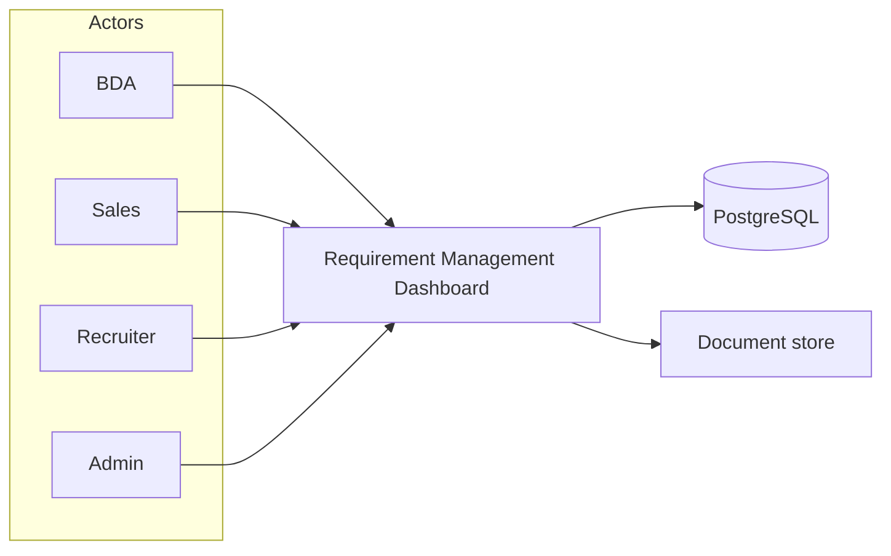
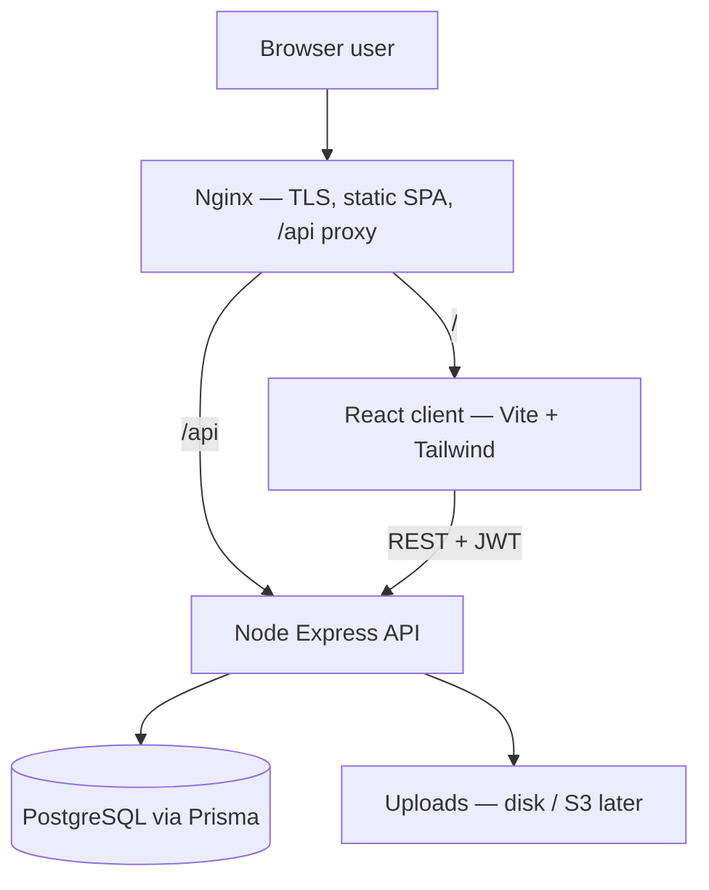
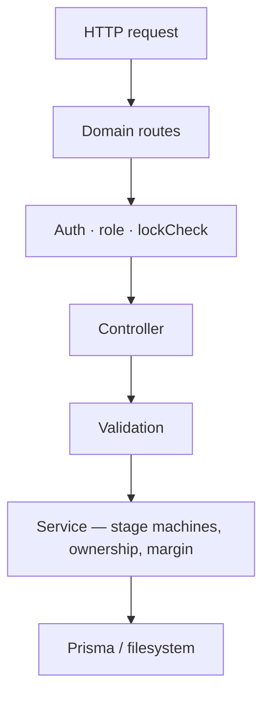
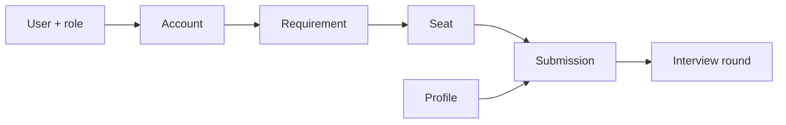
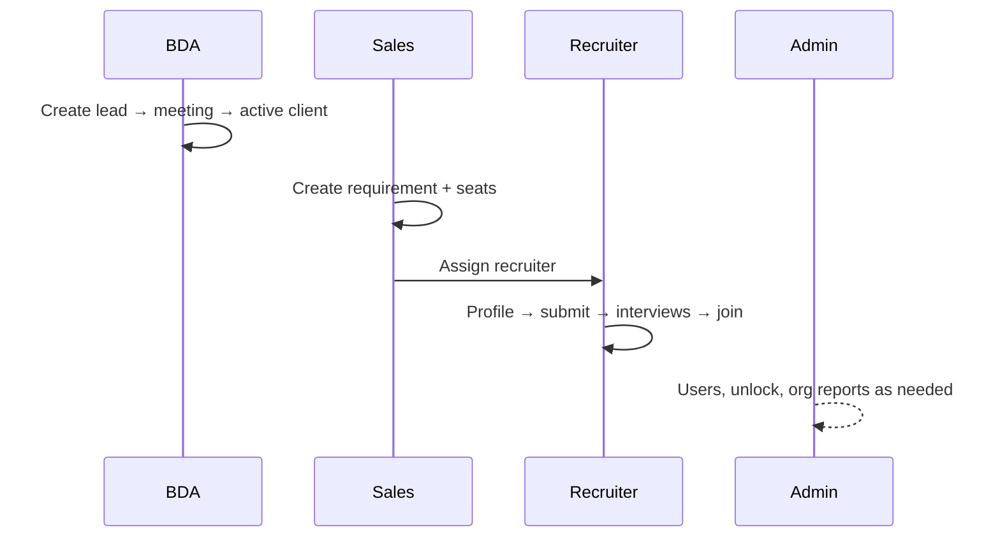
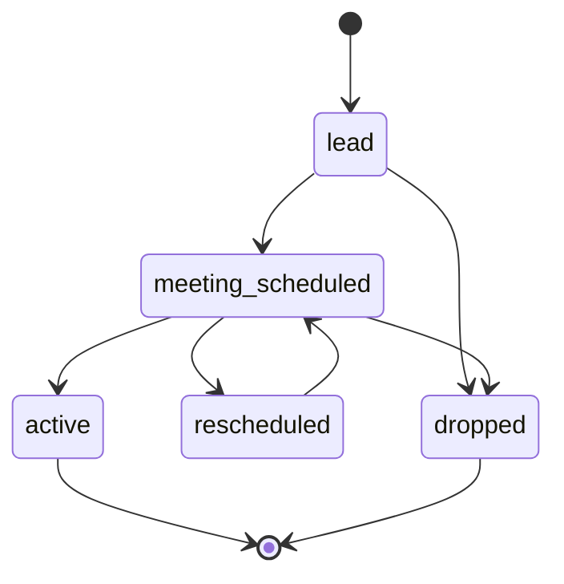
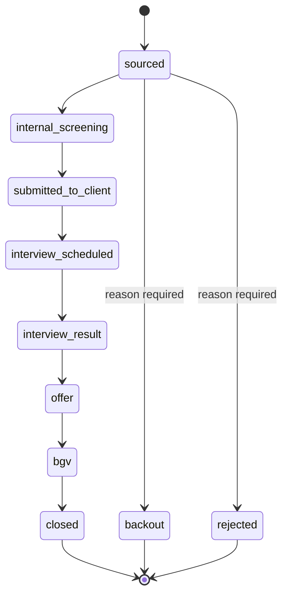
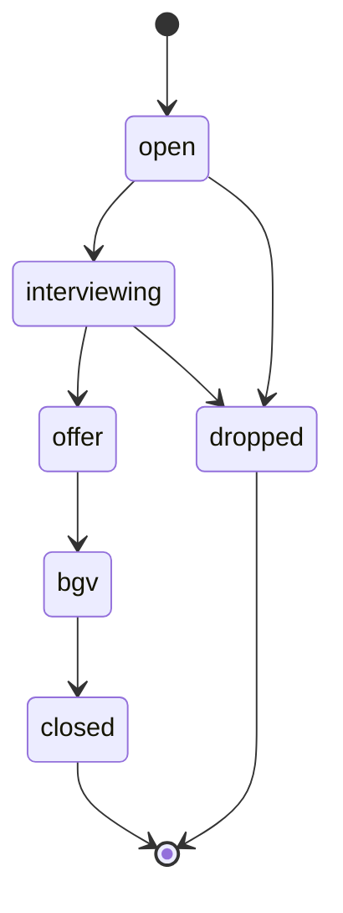

# Architecture Overview, Feature Map & User Journeys

| Field | Value |
|---|---|
| **Product** | Delphic One — Requirement Management Dashboard |
| **As of** | 2026-08-21 |
| **Audience** | Stakeholders, new developers, reviewers |
| **Full HLD** | [HLD.md](HLD.md) |
| **Field specs** | [Requirement-Dashboard-System-Design-v2.md](Requirement-Dashboard-System-Design-v2.md) |
| **API contract** | [API-Spec-and-Build-Plan.md](API-Spec-and-Build-Plan.md) |

## Table of Contents

1. [How to share this document](#1-how-to-share-this-document)
2. [Architecture diagram](#2-architecture-diagram)
3. [Feature map](#3-feature-map)
4. [User journeys](#4-user-journeys)
5. [Stage pipelines](#5-stage-pipelines)
6. [Role capability matrix](#6-role-capability-matrix)
7. [Related docs](#7-related-docs)

---

## 1. How to share this document

This file lives in the git repo under `docs/`. Anyone with repo access can open it on GitHub (Mermaid diagrams render in the GitHub UI).

**Recommended share options**

| Option | Steps |
|---|---|
| **GitHub link (best)** | Commit + push this file, then send the blob URL, e.g. `https://github.com/<org>/<repo>/blob/<branch>/docs/ARCHITECTURE-OVERVIEW.md` |
| **PR / review** | Open a PR that adds or updates these docs; reviewers read the Files changed tab |
| **Email / Slack** | Attach or paste the raw markdown, or send the GitHub link after push |
| **Pair with HLD** | Also send [HLD.md](HLD.md) for the detailed design narrative |

**Note on the Cursor Canvas:** The interactive canvas (`delphic-architecture-journeys.canvas.tsx`) is local to Cursor IDE and is **not** in this repo. Use these markdown docs for sharing outside Cursor.

---

## 2. Architecture diagram

### 2.1 System context (L1)

### 2.2 Containers and request path (L2)

### 2.3 Server layers (L3)

### 2.4 Stack summary

| Layer | Technology |
|---|---|
| Client | React + Vite + Tailwind (`client/`) |
| API | Node.js + Express (`server/`) |
| ORM / DB | Prisma → PostgreSQL |
| Edge | Nginx (TLS; SPA + API proxy) |
| Local runtime | Docker Compose (`db`, `server`, `client`) |

---

## 3. Feature map

### 3.1 Domain capabilities

| Domain | What it covers |
|---|---|
| **Auth & users** | Login, refresh, change password, admin user provisioning |
| **Accounts** | Client/vendor leads, stage machine, BDA ownership, lock on drop |
| **Requirements & seats** | Jobs, seats, assign/unassign history, seat stages |
| **Profiles** | Candidates, skills, CTC, resume upload |
| **Submissions** | Put forward, pipeline stages, margin, kanban |
| **Interviews** | Internal + client rounds, feedback, rating |
| **Collaboration** | Comments, documents, stage history |
| **Ops & insights** | Role dashboard, stuck lists, reports, Excel/PDF export |

### 3.2 Entity happy path

Supporting entities: **RequirementAssignment**, **Comment**, **Document**, **StageHistory**.

---

## 4. User journeys

### 4.1 End-to-end handoff (all roles)

| # | Who | Handoff |
|---|---|---|
| 1 | BDA | Creates lead → converts client to **active** |
| 2 | Sales | Opens requirement + seats; **assigns** recruiter |
| 3 | Recruiter | Adds profile, submits to seat, runs interviews to **join** |
| 4 | Admin | Unlocks records, manages users, reads **org** reports |

### 4.2 BDA — lead to active account

| Step | Action | Outcome |
|---|---|---|
| 1. Capture lead | Create account (client or vendor) with company + POC | Stage = `lead`; BDA is owner |
| 2. Schedule meeting | Move → `meeting_scheduled`; set mode, date, notes | Tracked; appears on stuck list if idle |
| 3. Convert or loop | → `active`, or `rescheduled` → meeting again | Active client unlocks Sales requirements |
| 4. Exit | Drop with reason → record locks | Visible in reports; Admin can unlock |

### 4.3 Sales — open job and assign

| Step | Action | Outcome |
|---|---|---|
| 1. Pick active client | Open an active client account | Requirements only on active clients |
| 2. Create requirement | JD, tech stack, budget, seats, SLA | Status = `open`; Sales is owner |
| 3. Add seats | One seat per headcount | Seat status = `open` |
| 4. Assign recruiters | Assign / unassign (history kept) | Recruiters see assigned jobs |
| 5. Steer status | `open` → `in_progress` → hold / closed / dropped | Terminal states lock the requirement |

### 4.4 Recruiter — source through join

| Step | Action | Outcome |
|---|---|---|
| 1. Add profile | Candidate + resume + skills / CTC / source | Ready to submit |
| 2. Put forward | Submission: seat + rates; live margin | Stage = `sourced` |
| 3. Internal screen | → `internal_screening`; internal interview + feedback | Pass → client; fail → rejected |
| 4. Client cycle | Schedule rounds → offer → BGV | Multi-round until required rounds pass |
| 5. Close | `closed` + `joined_at`, or backout / rejected + reason | Locks; counts in reports |

### 4.5 Admin — keep the org unblocked

| Step | Action | Outcome |
|---|---|---|
| 1. Provision users | Create / deactivate BDA, Sales, Recruiter, Admin | Team can log in with roles |
| 2. Oversee pipeline | Dashboard: stuck lists, activity | Intervene on SLA slips |
| 3. Unlock | Unlock locked entity with mandatory reason | Audited; re-locks on next terminal move |
| 4. Report & export | Recruiter / sales / vendor / aging / closure | Org-wide visibility |

---

## 5. Stage pipelines

### 5.1 Account (lead)

### 5.2 Submission pipeline

From **any** stage: `backout` or `rejected` (reason required).

### 5.3 Seat status

Usually derived from the furthest-advanced active submission; can be overridden. **`joined_at`** is what counts as closure for performance.

---

## 6. Role capability matrix

| Capability | BDA | Sales | Recruiter | Admin |
|---|---|---|---|---|
| Own accounts (leads) | Yes | View | View | Full |
| Requirements + seats | View | Own | Assigned | Full |
| Assign recruiters | — | Yes | — | Yes |
| Profiles + submissions | View | View | CRUD | Full |
| Unlock locked records | — | — | — | Yes |
| Reports scope | Own leads | Own reqs | Own subs | Org-wide |

---

## 7. Related docs

| Doc | Use when |
|---|---|
| [HLD.md](HLD.md) | Detailed high-level design (principles, security, ops, abstraction budget) |
| [Requirement-Dashboard-System-Design-v2.md](Requirement-Dashboard-System-Design-v2.md) | Field-level data model |
| [API-Spec-and-Build-Plan.md](API-Spec-and-Build-Plan.md) | Exact HTTP contracts |
| [SPRINT-PLAN.md](SPRINT-PLAN.md) | Ticket status and weekly delivery plan |
| [UI-UX-JIRA.md](UI-UX-JIRA.md) | Frontend UX standing rule |
| [AGENTS.md](AGENTS.md) | Repo layout and local setup |
