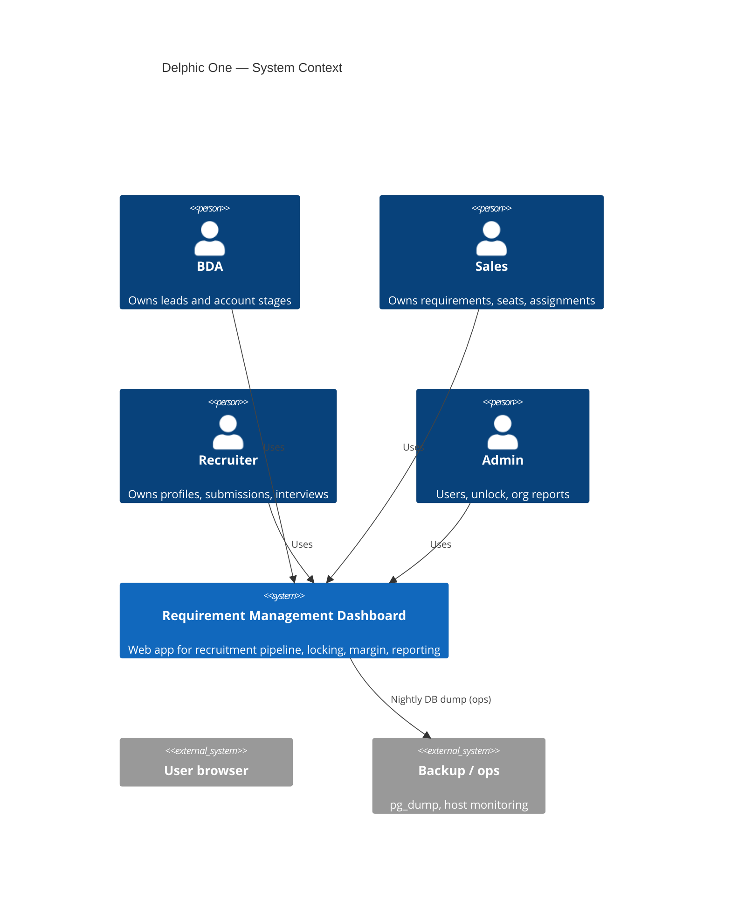
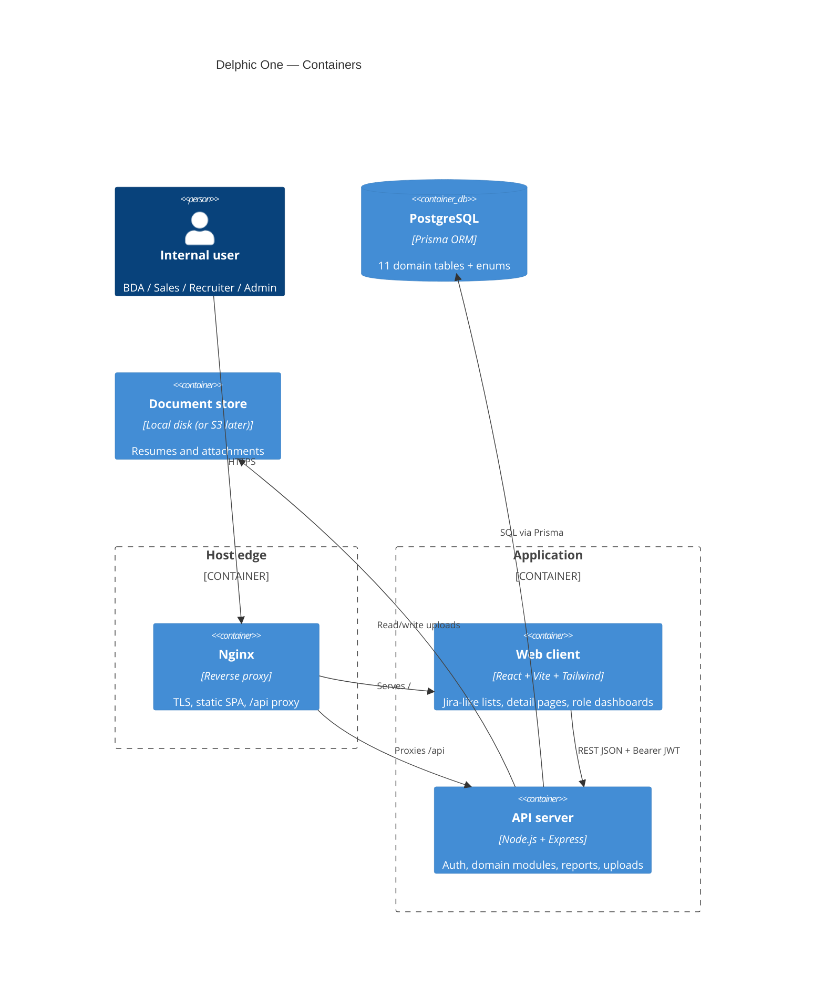
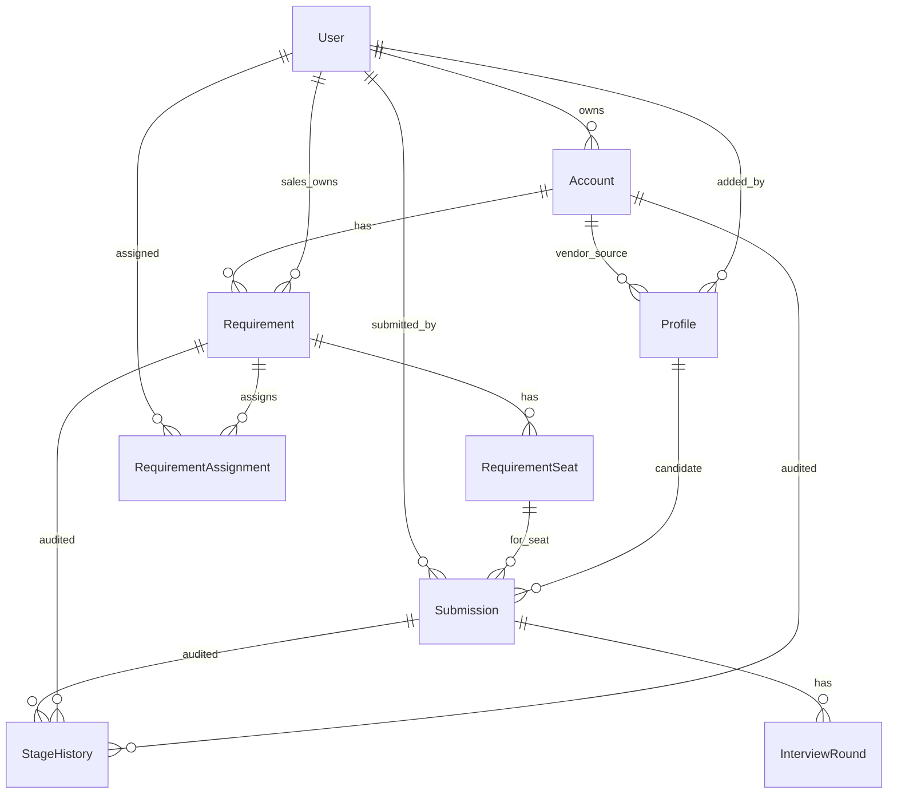
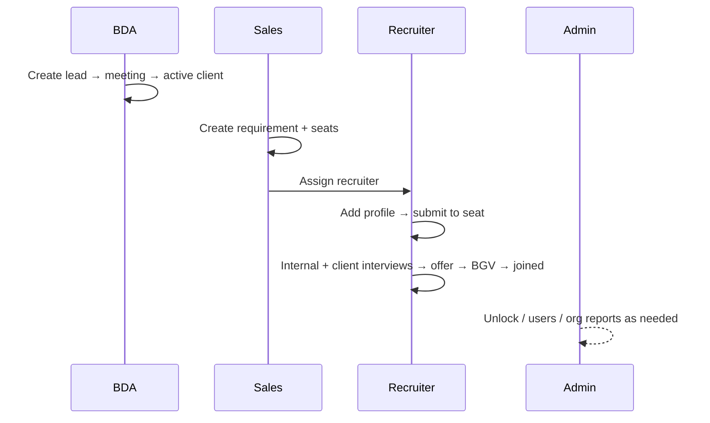

# High-Level Design — Delphic Requirement Management Dashboard

| Field | Value |
|---|---|
| **Product** | Delphic One — Requirement Management Dashboard |
| **Status** | v1 implementation in progress (backend complete; frontend detail/forms open) |
| **As of** | 2026-08-21 |
| **Tenancy** | Single tenant |
| **Related** | [System Design v2](Requirement-Dashboard-System-Design-v2.md) · [API Spec](API-Spec-and-Build-Plan.md) · [AGENTS](AGENTS.md) · [Sprint Plan](SPRINT-PLAN.md) |

## Table of Contents

1. [Purpose and scope](#1-purpose-and-scope)
2. [Design principles](#2-design-principles)
3. [L1 — System context](#3-l1--system-context)
4. [L2 — Containers](#4-l2--containers)
5. [L3 — Components](#5-l3--components)
6. [Domain model and relationships](#6-domain-model-and-relationships)
7. [Workflow state machines](#7-workflow-state-machines)
8. [Cross-cutting concerns](#8-cross-cutting-concerns)
9. [API surface (logical)](#9-api-surface-logical)
10. [Security design](#10-security-design)
11. [Reporting and analytics](#11-reporting-and-analytics)
12. [Deployment and operations](#12-deployment-and-operations)
13. [Codebase structure](#13-codebase-structure)
14. [Abstraction budget](#14-abstraction-budget)
15. [v1 vs deferred](#15-v1-vs-deferred)
16. [Open design decisions](#16-open-design-decisions)

---

## 1. Purpose and scope

### 1.1 Job to be done

Internal teams at Delphic need one system to run the recruitment pipeline end to end:

- Capture and convert **client / vendor leads** (BDA).
- Open **job requirements** and **seats**, assign recruiters (Sales).
- Source **candidates**, put them forward, run **interviews**, track **offer / BGV / join**, and compute **margin** (Recruiter).
- Provision users, unlock locked records, and read **org-wide reports** (Admin).

### 1.2 In scope (v1)

- Full core pipeline with stage machines and append-only stage history.
- Role-based access and ownership scoping.
- Record locking on terminal states, with admin unlock + reason.
- Margin / commercials on submissions.
- Role-scoped dashboard (including stuck lists).
- Reports with date range and Excel / PDF export.
- Comments and documents on core entities.
- Jira-like dense list / filter UX on the frontend ([UI-UX-JIRA.md](UI-UX-JIRA.md)).

### 1.3 Out of scope (deferred)

- Notifications (v2).
- Vendor / client external portals (v2).
- JIRA / Sheets migration tooling (post-launch).
- Multi-tenant SaaS isolation.
- Real-time collaboration (WebSockets).

---

## 2. Design principles

1. **Pipeline as state machines** — Account, seat, and submission progress only through documented transitions; every move is audited in `stage_history`.
2. **Auth and authorization at the edge** — JWT and role checks live in transport middleware; services receive a narrowed identity (`user id`, `role`).
3. **Thin transport, fat domain** — Route handlers parse HTTP and call services; multi-step business rules (stage advance, margin, ownership, lock) live in services / stage-machine modules.
4. **Ownership scopes visibility and mutation** — BDA owns accounts; Sales owns requirements; Recruiter owns submissions on assigned requirements; Admin sees everything.
5. **Lock is editability, not visibility** — Terminal records stay in lists and reports; `PATCH` / stage moves return locked errors until Admin unlocks with a reason.
6. **Single source of schema truth** — Prisma models and migrations define persistence; API validation mirrors enums and required fields.
7. **Prose-readable modules** — Domain folders follow `routes → controller → service → validation`; filenames answer “HTTP vs business vs IO”.

---

## 3. L1 — System context



**Actors**

| Actor | Primary goal |
|---|---|
| BDA | Convert leads to active clients / vendors |
| Sales | Open jobs, allocate seats, assign recruiters |
| Recruiter | Fill seats through submission pipeline to join |
| Admin | Keep org unblocked; measure performance |

There are **no external product integrations** in v1. The system is self-contained: browser ↔ API ↔ PostgreSQL ↔ file storage.

---

## 4. L2 — Containers



### 4.1 Container responsibilities

| Container | Responsibility | Does not own |
|---|---|---|
| **Web client** | Screens, forms, session storage of tokens, role-gated nav | Business stage legality (server enforces) |
| **API server** | Auth, validation, stage machines, ownership, reports, locking | HTML rendering |
| **PostgreSQL** | Durable entities, history, assignments | File blobs (URLs / paths only) |
| **Nginx** | TLS termination, static assets, API reverse proxy | Domain logic |
| **Document store** | Binary uploads | Access control (API gates entity access first) |

### 4.2 Request path (happy path)

1. Browser loads SPA from Nginx.
2. User logs in → `POST /api/v1/auth/login` → access + refresh JWT.
3. Subsequent calls send `Authorization: Bearer <access_token>`.
4. Express middleware authenticates, then role / ownership checks as needed.
5. Controller → validation → service → Prisma.
6. Response envelope: `{ success, data, message?, errors? }`.

### 4.3 Runtime topologies

| Mode | When | Notes |
|---|---|---|
| **Docker Compose** | Local / preferred verified path | Services: `db`, `server`, `client`. Host ports typically Postgres `5434`, client `8081`, API `4000`. |
| **PM2 + Nginx on VPS** | Legacy layout still present | `ecosystem.config.js` / `nginx.conf.example`; must be reconciled with Docker before claiming auto-deploy ready. |
| **GitHub Actions** | Push to `main` | CI present; deploy workflow gated on secrets / `DEPLOY_ENABLED`. |

---

## 5. L3 — Components

### 5.1 Client components

```text
client/src/
  app/App.jsx                 # Router + layout shell
  pages/<domain>/             # accounts, requirements, profiles, submissions, reports, dashboard, auth, users
  components/ui/              # DataTable, StatCard, Badge, shared primitives
  components/layout/          # AppLayout (nav)
  lib/apiClient.js            # Fetch wrapper + auth headers
  lib/authContext.jsx         # Session / user / role
```

**UI composition rule:** list pages are dense and filterable (Jira-like). Detail pages host stage controls, notes, files, and history. Role determines which nav items and widgets appear.

### 5.2 Server components

```text
server/src/
  index.js                    # Bootstrap, middleware stack, route mount, lifecycle logs
  middleware/                 # auth, lockCheck, errorHandler, requestLogger
  config/                     # env, Prisma client, logger
  modules/
    auth/                     # login, refresh, change-password
    users/                    # admin user CRUD + /me
    accounts/                 # client/vendor leads + stage
    requirements/             # jobs, seats, assign, stage machines
    profiles/                 # candidates
    submissions/              # pipeline, margin, interview rounds
    comments/ · documents/    # polymorphic attach to entities
    admin/                    # unlock
    dashboard/                # role-scoped summary + stuck lists
    reports/                  # performance, aging, export
```

**Module pattern (canonical):** `*.routes.js` → `*.controller.js` → `*.service.js` → `*.validation.js`.

**Call graph (allowed):**

```text
HTTP → routes → auth/role middleware → controller → validation → service → Prisma / filesystem
```

Services must not import Express `req`/`res`. Controllers must not embed multi-step domain workflows beyond orchestration of service calls.

### 5.3 Shared domain engines

| Concern | Location (conceptual) | Behavior |
|---|---|---|
| Account stage transitions | Accounts service + shared stage maps | `lead → meeting_scheduled → active / rescheduled / dropped` |
| Submission stage transitions | Submissions service + stage machine | Full pipeline + `backout` / `rejected` from any stage |
| Seat stage transitions | Seats paths + stage machine | Often derived from furthest submission; overridable |
| Margin calculation | Submissions service | From bill / pay rates and rate type |
| Lock enforcement | `lockCheck` middleware + service guards | Terminal → `is_locked`; mutate blocked |
| Ownership filters | Services (list/mutate) | Role-scoped queries and write guards |

---

## 6. Domain model and relationships

### 6.1 Core entity chain



### 6.2 Entity catalogue

| Entity | Purpose | Terminal / lock trigger |
|---|---|---|
| **User** | Identity + role (`bda` \| `sales` \| `recruiter` \| `admin`) | Soft-deactivate via `active` |
| **Account** | Unified client / vendor lead | `dropped` → locked |
| **Requirement** | Job / project need on an **active client** | `closed` / `dropped` → locked |
| **RequirementSeat** | One headcount slot | `closed` / `dropped` → locked; `joined_at` counts as closure |
| **RequirementAssignment** | Recruiter / sales assignment history (never deleted) | Soft end via `unassigned_at` |
| **Profile** | Candidate | Not terminal-locked like pipeline entities |
| **Submission** | Candidate × seat pipeline row + commercials | `closed` / `rejected` (and backout path) → locked |
| **InterviewRound** | Internal or client round + feedback / rating / result | Completing result sets `completed_at` |
| **StageHistory** | Append-only audit of stage moves / unlock | Immutable |
| **Document** | Uploaded file metadata linked to entity | — |
| **Comment** | Notes linked to entity | — |

### 6.3 Key invariants

1. A **requirement** may only attach to an account with `type = client` and `stage = active`.
2. **Seats** are created for headcount; submissions target a seat, not only a requirement.
3. **Assignments** are historical rows; unassign sets `unassigned_at` instead of deleting.
4. **Interview rounds** can be `internal` (recruiter) or client; submission advances toward offer only when required rounds pass.
5. **Margin** is computed server-side from submission commercial fields; UI may preview but server is authoritative.
6. **Unlock** requires Admin + mandatory reason; event is written to stage history; next terminal transition re-locks.

---

## 7. Workflow state machines

### 7.1 Account (lead)

```text
lead → meeting_scheduled → active
                         → rescheduled → meeting_scheduled (loop)
                         → dropped (terminal; allowed from earlier stages)
```

Same machine for `client` and `vendor`. Owner is the BDA (`owner_id`).

### 7.2 Requirement status

```text
open → in_progress → on_hold
                   → closed | dropped
```

Sales owns primary lifecycle (`sales_owner_id`). Assignments attach recruiters without replacing ownership.

### 7.3 Seat status

```text
open → interviewing → offer → bgv → closed
                                → dropped
```

Typically tracks the furthest-advanced active submission; recruiter may override when needed. Closure that matters for performance is **`joined_at`** on the seat.

### 7.4 Submission pipeline

```text
sourced → internal_screening → submitted_to_client → interview_scheduled
→ interview_result → offer → bgv → closed
```

From **any** stage: `backout` (reason required; seat reopened manually) or `rejected` (reason required).

### 7.5 Cross-role handoff



---

## 8. Cross-cutting concerns

### 8.1 Authentication and session

- Login returns short-lived **access JWT** (~1h) and **refresh token** (~7d).
- Refresh rotates access (and refresh per API contract).
- Change-password requires current password.
- Passwords stored as bcrypt hashes.
- Dev-only one-click role login exists on the client; disable via `VITE_DISABLE_QUICK_LOGIN=true` before production.

### 8.2 Authorization matrix

| Capability | BDA | Sales | Recruiter | Admin |
|---|---|---|---|---|
| Accounts | Create/edit **own** | View; create req on active clients | View | Full |
| Requirements / seats | View | Create/edit **own**; assign | View **assigned** | Full |
| Profiles / submissions | View | View | CRUD on assigned work | Full |
| Unlock | — | — | — | Yes + reason |
| Users admin | — | — | — | Yes |
| Reports | Own leads | Own requirements | Own submissions | Org-wide |

### 8.3 Locking

- Entities carry `is_locked`.
- Auto-set on terminal transitions.
- Locked: reads allowed; mutations return locked / 403-class errors.
- Admin unlock via `POST /admin/:entity_type/:entity_id/unlock` with `{ reason }`.

### 8.4 Validation and errors

- Trust-boundary validation in `*.validation.js` (Zod/Joi-style schemas).
- Uniform error handler; structured logging of validation vs 500s.
- List endpoints support pagination (`page`, `limit`) and filter query params.

### 8.5 Logging

- Zero-dependency logger (`LOG_LEVEL`: error | warn | info | debug).
- Pretty in development; JSON in production.
- HTTP access log (method, path, status, duration, user); skips health in tests.
- See [BACKEND-LOGGING.md](BACKEND-LOGGING.md).

### 8.6 Comments and documents

- Polymorphic: `entity_type` + `entity_id` on account, requirement, profile, submission (and related as implemented).
- Frontend should reuse shared Notes + Files components on all detail pages.

---

## 9. API surface (logical)

Base path: `/api/v1` (see API spec for full contracts).

| Area | Representative endpoints |
|---|---|
| Auth | `POST /auth/login`, `/auth/refresh`, `/auth/change-password` |
| Users | `GET /users/me`, admin `GET/POST/PATCH /users` |
| Accounts | CRUD + `POST /accounts/:id/stage` |
| Requirements | CRUD + assign / unassign + status |
| Seats | List/create under requirement + `POST /seats/:id/stage` |
| Profiles | CRUD + resume via documents |
| Submissions | CRUD + `POST /submissions/:id/stage` |
| Interviews | `POST /submissions/:id/interview-rounds`, `PATCH /interview-rounds/:id` |
| Comments / documents | List/create/delete by entity |
| Admin | `POST /admin/:entity/:id/unlock` |
| Dashboard | Role-scoped summary + stuck lists |
| Reports | Recruiter / sales / vendor / aging / closure + export |

**Envelope:** `{ success: boolean, data: T, message?: string, errors?: [] }`.

Authoritative field-level contract: [API-Spec-and-Build-Plan.md](API-Spec-and-Build-Plan.md).

---

## 10. Security design

| Control | Design |
|---|---|
| Transport | HTTPS only at edge (Certbot / TLS on Nginx) |
| AuthN | JWT access + refresh; bcrypt passwords |
| AuthZ | Role middleware on routes; ownership checks in services |
| Input | Schema validation on write paths |
| Login abuse | Rate limit on `/auth/login` |
| CORS | Locked to frontend origin |
| Secrets | Env / `.env` (never committed); `.env.example` as template |
| Locked records | Mutate denied; unlock audited |
| Uploads | Authenticated upload; store outside public git; serve via controlled paths |

**Threat notes (v1):**

- Stolen JWT → short access TTL + refresh rotation reduces window.
- Privilege escalation → Admin-only user create / unlock; non-admins blocked in UI and API.
- Data exfiltration via reports → role-scoped report queries; Admin for org-wide.

---

## 11. Reporting and analytics

| Report | Intent |
|---|---|
| Recruiter performance | Sourced vs submitted vs interviewed vs closed; funnel; time-in-stage; backout/reject rates; interview feedback coverage / ratings; closures |
| Sales performance | Lead conversion; requirements opened/closed; closure time; budget pipeline; margin; interview stats on owned requirements |
| Vendor performance | Vendor-sourced profiles through shortlist/close; margin; backout; time-to-submit |
| Aging / SLA | Stuck leads, requirements with no submissions, submissions stuck in stage, past `sla_days` |
| Closure | Joins with dates, final rates, margins — by period / client / recruiter |

Delivery: in-app tables/charts (frontend) + server-side **Excel / PDF export**.

Dashboard complements reports with **live widgets**: counts, stuck lists, recent activity — different per role.

---

## 12. Deployment and operations

### 12.1 Target topologies

**Compose (verified local):**

```text
[client container: Nginx SPA] ←→ [server container: Node]
                                        ↓
                               [db container: Postgres]
```

**VPS edge (production intent):**

```text
Internet → Nginx (TLS)
             ├── /     → React static build
             └── /api  → Node (Compose or PM2)
                           → PostgreSQL
                           → upload volume
```

### 12.2 Operational requirements

- Health endpoint for process liveness (`/health` or equivalent).
- Migrations applied on server start (`prisma migrate deploy`); **new** migrations generated on host against mapped DB port (not inside ephemeral `compose run` alone).
- Nightly `pg_dump` for backups.
- Seed users for non-prod; production accounts via Admin Users UI.
- Structured logs for ops triage.

### 12.3 Current risk to call out

Docker images and Compose exist, but the older PM2/`deploy.yml` path is not fully reconciled. Treat **live auto-deploy** as incomplete until RD-121 resolves Docker vs PM2 and secrets are configured.

---

## 13. Codebase structure

```text
delphic_one/
  client/                   # React SPA
  server/                   # Express API
    prisma/                 # schema.prisma, migrations, seed.js
    src/modules/            # domain modules
    src/middleware/
    src/config/
    tests/                  # API / stage / auth tests
  docs/                     # Specs, HLD, sprint, progress, UX
  docker-compose.yml
  package.json              # npm workspaces
```

**Branches:** `dev` → `staging` → `main` (production CI).

---

## 14. Abstraction budget

Keep the design junior-readable. Prefer concrete modules over deep interface trees.

| Allowed now | Avoid unless a second implementation appears |
|---|---|
| Free-function stage machines + service methods | Abstract `IRepository` per table with one Prisma impl |
| Thin controllers over services | Fat route handlers with SQL and stage logic |
| Polymorphic comments/documents via `entity_type` | Separate microservices per note type |
| Prisma as the DB adapter | Second ORM / hand-rolled query layer for the same DB |
| Shared UI primitives (DataTable, Notes, Files) | Multiple competing design systems |

**LOC guidance (soft):** keep a domain module’s service focused on that aggregate; split only when a second caller domain needs the same engine (as with shared stage maps).

---

## 15. v1 vs deferred

| Capability | v1 | Later |
|---|---|---|
| Full pipeline + interviews + margin | Yes | — |
| Locking + admin unlock | Yes | — |
| Role dashboard + reports + export | Yes | — |
| Comments / documents | Yes | — |
| Notifications / email / Slack | — | v2 |
| External client/vendor portals | — | v2 |
| JIRA/Sheets import | — | Post-launch |
| Multi-currency FX table for margin | Open (see §16) | Possible v1.1 |
| SSO | — | Future |

---

## 16. Open design decisions

These remain product/engineering decisions from the system design; they affect reports and commercials:

1. **Aging / SLA default threshold** — how many days before a lead, requirement, or submission is “stuck”?
2. **CTC storage convention** — always annual with UI conversion, or value + period enum?
3. **Cross-currency margin** — fixed admin FX table, or skip cross-currency margin in v1?

Until decided, implementers should follow existing API field shapes and avoid inventing silent FX conversion.

---

## Document control

| Item | Detail |
|---|---|
| Supersedes | N/A (first HLD) |
| Authoritative detail for fields | [Requirement-Dashboard-System-Design-v2.md](Requirement-Dashboard-System-Design-v2.md) |
| Authoritative HTTP contracts | [API-Spec-and-Build-Plan.md](API-Spec-and-Build-Plan.md) |
| Delivery plan | [SPRINT-PLAN.md](SPRINT-PLAN.md) |
| Visual companion | Cursor canvas `delphic-architecture-journeys.canvas.tsx` (Architecture / Features / Journeys / Pipelines / HLD) |
