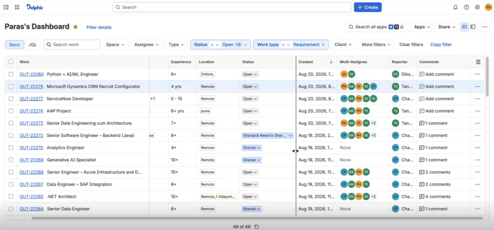

# UI/UX direction — Jira-like

**Status:** standing product requirement (noted Aug 21, 2026)  
**Audience:** anyone building or reviewing frontend work  
**Reference screenshot:** [references/jira-like-dashboard-reference.png](references/jira-like-dashboard-reference.png)

## Table of contents

1. [Rule](#1-rule)
2. [What “like Jira” means here](#2-what-like-jira-means-here)
3. [Screen anatomy (from reference)](#3-screen-anatomy-from-reference)
4. [Apply by page type](#4-apply-by-page-type)
5. [What not to copy](#5-what-not-to-copy)
6. [Definition of done for UI work](#6-definition-of-done-for-ui-work)

---

## 1. Rule

**All primary product UI must feel like Atlassian Jira** (issue search / filters / list view), not a generic admin CRUD theme.

This is a hard product direction for list pages, filters, dashboards, and detail chrome. New frontend tickets (RD-101 onward, RD-115 audit, etc.) must follow this note unless the human explicitly overrides it.

When in doubt, open the reference screenshot and match density, hierarchy, and interaction patterns.

---

## 2. What “like Jira” means here

| Pattern | Expectation |
|---|---|
| Density | Compact rows, tight padding, small clear type — power-user table, not airy marketing cards |
| Top chrome | Product name, global search, primary **Create**, notifications/help/settings, user avatar |
| Page header | Named dashboard/view title (e.g. “Paras's Dashboard”), optional favorite, secondary search/share/view toggles |
| Filters | Basic filter chips/dropdowns (Space / Assignee / Type / Status / Work type / Client) plus room for an advanced query mode later |
| List | Dense table: ID + title link, tags (experience, location), inline status control, dates, avatar stacks, reporter, comments affordance, row `…` menu |
| Selection | Row checkboxes for bulk actions |
| Status | Inline status control on the row (dropdown-style), color-coded |
| People | Circular initials avatars; overflow as `+N` |
| Feedback | Row hover highlight; footer count like “49 of 49” with refresh |

Visual language: clean sans-serif, thin borders, light grey surfaces, blue for primary actions and ID links — familiar Jira/Atlassian work-management feel.

---

## 3. Screen anatomy (from reference)

```text
┌──────────────────────────────────────────────────────────────┐
│ Delphic │  Global search          │ + Create │ 🔔 ? ⚙  PG │
├──────────────────────────────────────────────────────────────┤
│ Paras's Dashboard ★ │ search apps │ Apps │ Share │ view toggles │
├──────────────────────────────────────────────────────────────┤
│ Basic | JQL │ Search work │ Space │ Assignee │ Type │ Status │ … │
├──────────────────────────────────────────────────────────────┤
│ ☐ │ Work (ID + title) │ Exp │ Loc │ Status │ Created │ Assignees │ … │
│ … dense interactive rows …                                   │
├──────────────────────────────────────────────────────────────┤
│ 49 of 49  ↻                                                  │
└──────────────────────────────────────────────────────────────┘
```

Reference image (stakeholder-provided target look):



**Notification bell** (🔔 in the top chrome): a right-aligned actions cluster in the page `<header>` (`AppLayout.jsx`) holds `NotificationBell` — unread badge capped at `9+`, a `framer-motion` popover reusing the account-menu pattern (`role="menu"`, outside-click, Esc), latest 20 items, "Mark all read", and footer links to `/notifications` and `/notifications/preferences`. Under `sm` the popover is a full-width sheet. Notification fetches are non-critical: failures are swallowed, never a red banner. Room is left in the cluster for future help / settings icons. See [features/RD-NOTIFICATIONS-AND-CALENDAR.md](../features/RD-NOTIFICATIONS-AND-CALENDAR.md) §5.3.

---

## 4. Apply by page type

| Surface | Jira-like treatment |
|---|---|
| Requirements / jobs list | Closest match to the reference: filters + dense issue-style rows |
| Accounts, profiles, submissions lists | Same table/filter chrome; columns adapted to domain |
| Dashboard (role home) | Named view + filters + stuck/work lists in the same dense language — not a sparse card grid only |
| Detail pages | Issue-style header (key/id + title + status + people) with tabs/sections below |
| Create / edit | Modal or side panel from **Create** / row actions where natural; full pages only when the form is large |
| Kanban (RD-112) | Board view as an alternate to list, still under the same top chrome and filters |

---

## 5. What not to copy

- Do not brand as “Jira” or ship Atlassian trademarks/logos.
- Do not implement full JQL unless product asks — keep a **Basic** filter bar first; label advanced mode only when we build it.
- Do not paste Slack/GitHub/Drive “search all apps” unless we actually integrate those products.
- Domain labels stay ours (Requirement, Client, Seat, Submission) — Jira is the UX pattern, not the data model.

---

## 6. Definition of done for UI work

A frontend change is not done for UX if a stakeholder familiar with Jira would describe the screen as “a generic admin table.”

Checklist:

- [x] Dense list or issue header matches the reference feel (Accounts, Profiles, Requirements, Submissions, Dashboard)
- [x] Primary Create / filter / status / people patterns present where relevant (Create on Accounts/Profiles; filters on all four lists)
- [x] No oversized card-only layout for primary work queues
- [x] Compared against [references/jira-like-dashboard-reference.png](references/jira-like-dashboard-reference.png) before calling RD-115 / list polish done — see [RD-115-SPEC-WALKTHROUGH.md](RD-115-SPEC-WALKTHROUGH.md)
